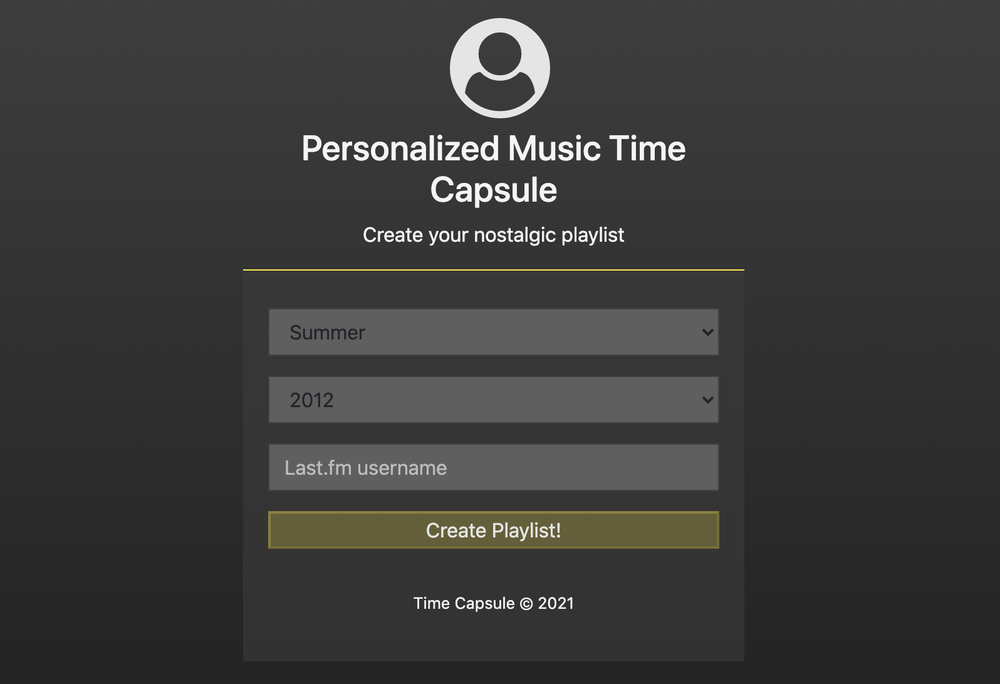

# Personalized Musical Time Capsule
> Web application for generating personalized music playlists based on a time period in the past.

[](https://www.python.org/downloads/release/python-390/)
[![Django Version][django-image]][django-url]
[![Build Status][github-image]][github-url]

Time Capsule is a Django based web application, purposed for generating nostalgic personalized
playlists. Currently, supporting Last.fm & Spotify users.

By entering a Last.fm username, a time period in the past, and log in using a Spotify account, 
the application will generate a personalized time capsule playlist. 

The app is currently hosted at:

https://personalized-time-capsule.herokuapp.com/




## Development Setup
- download or clone the repository
  

- add .env file with the following variables:
  SECRET_KEY, SOCIAL_AUTH_SPOTIFY_KEY, SOCIAL_AUTH_SPOTIFY_SECRET, 
  LASTFM_API_KEY, LASTFM_SHARED_SECRET, DATABASE_URL, BASICAUTH_USERS
  

- install Poetry - run `pip install poetry`
- install requirements - run `poetry install`
- run `python manage.py runserver`

### Run tests

- run `pytest`

### Run static code analysis

- Code style:
```sh
pylama --skip=*/migrations/*.py
```

- Security checks:
```sh
bandit -r . --configfile bandit.yaml
```

- Type checking:
```sh
mypy .
```


## License

Distributed under the MIT license @ [theLionWar](https://github.com/theLionWar)

```
Copyright (c) 2021 Arnon Cohen

Permission is hereby granted, free of charge, to any person obtaining a copy
of this software and associated documentation files (the "Software"), to deal
in the Software without restriction, including without limitation the rights
to use, copy, modify, merge, publish, distribute, sublicense, and/or sell
copies of the Software, and to permit persons to whom the Software is
furnished to do so, subject to the following conditions:

The above copyright notice and this permission notice shall be included in all
copies or substantial portions of the Software.

THE SOFTWARE IS PROVIDED "AS IS", WITHOUT WARRANTY OF ANY KIND, EXPRESS OR
IMPLIED, INCLUDING BUT NOT LIMITED TO THE WARRANTIES OF MERCHANTABILITY,
FITNESS FOR A PARTICULAR PURPOSE AND NONINFRINGEMENT. IN NO EVENT SHALL THE
AUTHORS OR COPYRIGHT HOLDERS BE LIABLE FOR ANY CLAIM, DAMAGES OR OTHER
LIABILITY, WHETHER IN AN ACTION OF CONTRACT, TORT OR OTHERWISE, ARISING FROM,
OUT OF OR IN CONNECTION WITH THE SOFTWARE OR THE USE OR OTHER DEALINGS IN THE
SOFTWARE.
```


## Contributing

1. Fork it (<https://github.com/thelionwar/time_capsule/fork>)
2. Create your feature branch (`git checkout -b feature/fooBar`)
3. Commit your changes (`git commit -am 'Add some fooBar'`)
4. Push to the branch (`git push origin feature/fooBar`)
5. Create a new Pull Request

<!-- Markdown link & img dfn's -->
[django-image]: https://img.shields.io/static/v1?label=Django&message=3.2&color=blue
[django-url]: https://docs.djangoproject.com/en/3.2/releases/3.2/
[github-image]: https://img.shields.io/github/workflow/status/theLionWar/time_capsule/ci
[github-url]: https://github.com/theLionWar/time_capsule/actions

